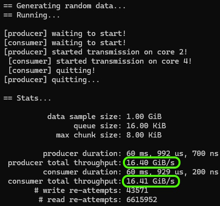
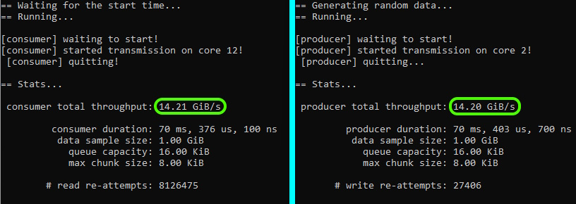

# tx-queue

A lock-free transactional circular queue implementation for single-producer/single-consumer scenarios, supporting both intra-process and inter-process communication via shared memory.

## Building

##### Prerequisites

- [premake5](https://premake.github.io/) on your PATH.
- Visual Studio.

##### Instructions

1. Navigate to the `support` folder.
2. Run `open.bat` to generate and open the Visual Studio solution.
3. In Visual Studio:
   - Default project is `intra` (single-process). Build and run it directly, or:
   - To run inter-process tests, go to **Solution > Properties > Configure Startup Project**, select `inter-consumer` and `inter-producer` (see screenshot below).
   - For better performance results, compile and execute the **Release** version.


## Single-Process Queue (`tx_queue_sp_t`)

Process with two threads: a producer that writes to the queue and a consumer that reads from it.

```cpp
// Create a queue before we create the threads

int main() {

    auto queue = tx_queue_sp_t (8 * 1024); // 8 KiB queue
    if (!queue) {
        return -1;
    }

    // create threads and wait until they are done

    ...

    return 0;
}

// producer thread

int producer(tx_queue_sp_t& _queue) {
    ...

    if (auto write_op = tx_write_t(_queue)) {
        write_op.write(42); // the transation auto-invalidates on error
        ...
        if (some other condition) {
            write_op.invalidate();
        }
    } // upon destruction of write_op it is commited


    ...
}

// consumer thread

int consumer(tx_queue_sp_t& _queue) {
    ...

    if (auto read_op = tx_read_t(this->queue_)) {
        int val;
        read_op.read(val); // the transation auto-invalidates on error
        ...
        if (some other condition) {
            write_op.invalidate();
        }
    } // upon destruction of read_op it is commited
```

## Multi-Process Queue (`tx_queue_mp_t`)

Share data between two processes via shared memory. It only differs on the queue creation.

##### Producer process

```cpp
int main(int _argc, const char* _argv[]) {
    // construct the shared memory object (8 KiB + the size of the queue status)

    constexpr auto mem_size = sizeof(tx_queue_status_t) + 8 * 1024;
    auto mem = shared_memory(L"unique_id", mem_size);

    // construct the queue directly on the shared memory 

    auto queue = tx_queue_mp_t((uint8_t*)*mem, mem_size);

    ...

    // same as in single-process mode

    ...
```

- Shows basic queue creation (`tx_queue_sp_t`), writing an integer, and reading it.  
- Mirrors the structure in your first file but stripped to essentials.  
- Assumes a simple, synchronous flow for clarity.

##### Consumer process

```cpp
int main() {

    // open existing shared memory and queue

    auto mem = shared_memory(L"unique_id");
    auto queue = tx_queue_mp_t((uint8_t*)*mem, mem.get_size());

    ...

    // same as in single-process mode

    ...

}
```

## Performance results

on my rig: AMD Ryzen 9 5950X (16 cores), 64GB RAM, Windows 11 Pro

Single-process results



Multi-process results


